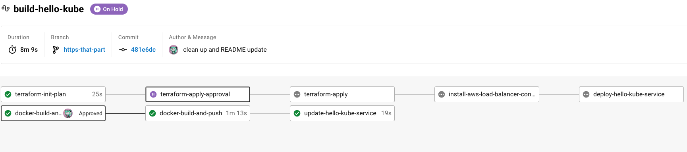

# hello-kube
A basic static web app deployment on Kubernetes.
Accessible at: `https://nrober-dev.com`

## Project Structure
This repo contains three key directories:
- `app/` contains the custom Dockerfile and `index.html` used to render the static site
- `service/` contains the necessary k8s manifest files for deploying the service to k8s
- `terraform/` contains the TF files necessary for deploying EKS resources in AWS

## CI/CD Architecture
The application is deployed to Amazon EKS via Terraform executing on CircleCI:

### Deploying from Scratch
1. Push the first `latest` tagged image to the ECR repo (see `docker-build-and-push` job in `.circleci/config.yml` for commands).
2. In the CircleCI UI, approve the Terraform workflow to provision the necessary EKS resources and install the AWS Load Balancer Controller to the cluster. 
The final step of this workflow will deploy the load balancer service (accessible only via HTTPS) using the `latest` image in ECR.
3. The service deployment assumes the existence of a custom domain name registered with Route 53, and associated SSL certificate obtained via AWS ACM.
Follow these steps for first-time setup:
    1. Register a new domain name with Route 53 ([source](https://docs.aws.amazon.com/Route53/latest/DeveloperGuide/domain-register.html))
    2. Request an SSL certificate via ACM, and add this record to Route 53 ([source](https://docs.aws.amazon.com/acm/latest/userguide/gs-acm-request-public.html))
    3. Add a new record to route traffic to the LB from the custom domain ([source](https://docs.aws.amazon.com/Route53/latest/DeveloperGuide/routing-to-elb-load-balancer.html))
    4. Reference this certificate ARN on line 39 of `service/hello_kube_service.yaml`

### Updating the Deployment
1. Approve the `docker-build-and-push` step in the CircleCI UI which will rebuild the image, push to ECR, then execute a `kubectl rollout restart` command that refreshes the service with the latest ECR image.

### Next Steps
1. This demo project uses a public ECR image for simplicity and cost savings, in a real deployment a private repo would be used with an associated Kubernetes secret (see [this reference doc](https://medium.com/clarusway/how-to-use-images-from-a-private-container-registry-for-kubernetes-aws-ecr-hosted-private-13a759e2c4ea)).
2. The AWS Load Balancer Controller installation process could likely be simplified a bit using a Terraform module such as [this one](https://registry.terraform.io/modules/Young-ook/eks/aws/latest/examples/lb)  instead of an additional Circle step running `kubectl` commands.
3. Automating the manual steps of creating the custom domain and SSL certificate would bring this deployment closer to full automation.

---
## Debugging Resources
### Local Setup for 11ty
See [this doc](https://www.11ty.dev/docs/getting-started/) for setup instructions on installing/running 11ty!

### Running Application Locally via Docker Run
1. Build the image from the `app/` directory with `docker build -t hello-kube .`
2. Launch the web app with `docker run -p 8080:8080 hello-kube`

### Starting a Local Cluster via Minikube
1. Start a local cluster with `minikube start`
2. Execute `eval $(minikube docker-env)` to point the Docker build to the Minikube daemon (enables `imagePullPolicy` to `never`)
3. Run `kubectl apply -f hello_kube_service.yaml` (should edit the config to expose over http without the SSL certificate specification)
4. Check `kubectl get pods` then run `kubectl logs {pod name}` to ensure the container started successfully.
5. Run `minikube service hello-kube --url`, paste the output into browser to access static site.
6. Teardown with `kubectl delete services/hello-kube` and `kubectl delete deployment/hello-kube`
7. Verify all pods are terminated with `kubectl get pods`, and finally terminate the cluster with `minikube stop`

### Deploying to AWS EKS Manually via CLI
0. Ensure `eksctl` is installed, instructions [here](https://docs.aws.amazon.com/eks/latest/userguide/eksctl.html)
1. Start an eks cluster: `eksctl create cluster --name nrober-dev --region us-west-1`
2. Install the Load Balancer Controller add-on following [these steps](https://docs.aws.amazon.com/eks/latest/userguide/aws-load-balancer-controller.html)
3. Apply the service with `kubectl apply -f hello_kube_service.yaml`

### Resources:
https://github.com/hashicorp/learn-terraform-provision-eks-cluster
https://aws.amazon.com/premiumsupport/knowledge-center/terminate-https-traffic-eks-acm/
https://docs.aws.amazon.com/eks/latest/userguide/sample-deployment.html